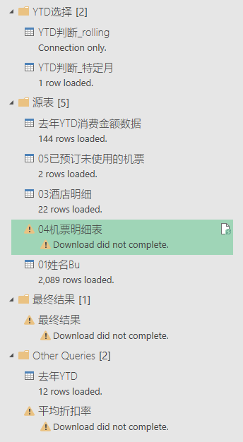
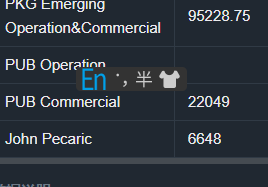

# 源文件说明
路径下应有以下7个excel文件
1. YTD判断.xlsx
3. 表01姓名与BU名称.xlsx
4. 表02机票酒店合计金额2022年度.xlsx
5. 表03酒店YTD 2月2023年度_带员工编号.xslx
6. 表04机票YTD 2月2023年度.xlsx
7. 表05截止1月31日已预订未使用的机票.xlsx
8. 结果表.xlsx

### Note: excel重命名会导致结果表报错
##### 问题描述
如果前7张excel文件名发生更改，会导致【结果表.xlsx】 刷新报错。
比如：

所有引用了此表的派生表都会报错：

##### 解决办法：
1. 进入Power Query 找到原表 点击 Go To Error

2. 点击Source

3. 重新现在重命名之后的excel文件

4. 找到其他报错的派生表，修改数据源的绝对路径即可。

### 文件更新的说明

【结果表.xlsx】中显示的计算结果来自YTD判断、表01、表02、表03、表04及表05的源数据。所以所有在计算过程中引用过的数据，列名或者数据格式的更改都有可能导致结果表报错。建议以后更新源数据的时候明确数据格式。如果发生报错，解决方法同上，进入Power Query，从上到下点击操作步骤，直到找到报错的步骤再进行修改。

#### YTD判断.xlsx
###### 数据预览
| Year | Month | 请填充：表5截止日期 | 请填充YTD的截止月份 | 判断    |
|------|-------|------------|-------------|-------|
| 2023 | 1     | 1/31/2023  | 1           | TRUE  |
| 2023 | 2     | 1/31/2023  | 1           | FALSE |
| 2023 | 3     | 1/31/2023  | 1           | FALSE |
| 2023 | 4     | 1/31/2023  | 1           | FALSE |
| 2023 | 5     | 1/31/2023  | 1           | FALSE |
| 2023 | 6     | 1/31/2023  | 1           | FALSE |
| 2023 | 7     | 1/31/2023  | 1           | FALSE |
| 2023 | 8     | 1/31/2023  | 1           | FALSE |
| 2023 | 9     | 1/31/2023  | 1           | FALSE |
| 2023 | 10    | 1/31/2023  | 1           | FALSE |
| 2023 | 11    | 1/31/2023  | 1           | FALSE |
| 2023 | 12    | 1/31/2023  | 1           | FALSE |

###### Sheet说明
此表只有一个sheet: List1

###### 表格作用
传递参数：第三列表5截止日期及第四列YTD的截止月份
1. 作用1：计算已预订未使用的机票截止日期
	1. 结果表中需要计算截止2023年1月31号已预订未使用的机票，所以第三列填充：2023/1/31
	2. 如果后续需要计算截止2024年6月30号已预订未使用的机票，则整列修改为2024/6/30
2. 作用2：YTD月份
	1. 比如，第四列填充1，结果就会返回当前年份YTD 1月的数据
	2. note: 只会生成当前年份的数据。

#### 表01姓名与BU名称
###### 数据预览
| Name           | 姓名  | email                    | BU名称                              | SM（排序）      | 工号      |
|----------------|-----|--------------------------|-----------------------------------|-------------|---------|
| Kissinger Chen | 陈敬锋 | kissinger.j.chen@rrd.com | PKG Sachi Operation               | a.Gary Wang | 3525552 |
| Leo Wan        | 万峰  | leo.f.wan@rrd.com        | PKG Emerging Operation&Commercial | b.Eric Shu  | 3627077 |
| Mary Huang     | 黄丽  | mary.l.huang@rrd.com     | Supply Chain                      | g.Xu Bo     | 3524924 |
| Aaron Zhou     | 周伟  | aaron.w.zhou@rrd.com     | PKG Emerging Operation&Commercial | b.Eric Shu  | 3555045 |
| Ivy Chen       | 陈冰如 | ivy.b.chen@rrd.com       | PUB Operation                     | d.Jason Xue | 3609446 |
| Glen Zhang     | 张宝宁 | glen.b.zhang@rrd.com     | Supply Chain                      | g.Xu Bo     | 3399879 |
| Bruce Liu      | 刘俊  | bruce.j.liu@rrd.com      | PKG Emerging Operation&Commercial | b.Eric Shu  | 3634016 |
###### sheet说明
此表只有一个sheet: Sheet1
###### 表格作用
提供姓名/工号 - BU的对应关系

#### 表02机票酒店合计金额2022年度
##### 数据预览
| BU      | Month | 去年YTD |
|---------|-------|-------|
| Finance | 1     | 3920  |
| Finance | 2     | 3920  |
| Finance | 3     | 3920  |
| Finance | 4     | 3920  |
| Finance | 5     | 4193  |
| Finance | 6     | 4193  |
| Finance | 7     | 4500  |
| Finance | 8     | 6912  |
| Finance | 9     | 20826 |
| Finance | 10    | 23478 |
| Finance | 11    | 29069 |
| Finance | 12    | 0     |
| HR      | 1     | 24259 |
| HR      | 2     | 32041 |
| HR      | 3     | 39504 |

###### sheet说明
引用的是名为【去年YTD】的sheet，如果以后更新，请保持现在的数据格式。
其他sheet的变更不影响最终结果

#### 表03酒店YTD 2月2023年度_带员工编号
###### 数据预览
| RBE_NO          | BIZ_DTE    | RMB_AMT    | HOTEL                          | FROM       | TO         | DAYS | 姓名   | ENGLISHNAME       | 工号    | BUNAME_CN                    | BIZ_LINE              | BUHM                    | SUBMIT_DTE | STATUS   |
|-----------------|------------|------------|--------------------------------|------------|------------|------|--------|-------------------|---------|------------------------------|-----------------------|-------------------------|------------|----------|
| RBE202101020011 | 12/24/2020 |  1000.0000 | 潍坊天成商务宾馆               | 12/24/2020 | 12/29/2020 | 5    | 徐波   | Brain Xu - 277197 | 3360716 | 当纳利(昆山)包装科技有限公司	 | Sachi PKG             | Sachi PKG Operation     | 2022-01-02 | APPROVED |
| RBE202012310030 | 12/25/2020 |   378.0000 | 麗枫酒店                       | 12/24/2020 | 12/25/2020 | 1    | 曹剑勇 | jacky.j.cao       | 3553588 | 当纳利(成都)印刷有限公司     | Emerging PKG Domestic | Emerging PKG Commercial | 2022-01-02 | APPROVED |
| RBE202101030016 | 11/19/2020 |   590.0000 | 万达文华酒店                   | 11/18/2020 | 11/19/2020 | 1    | 袁佳华 | dennis.j.yuan     | 3111936 | 当纳利(上海)贸易有限公司     | General               | Infrastructure          | 2022-01-03 | APPROVED |
| RBE202101040007 | 1/1/2021   | 13410.0000 | 深圳市银濠花园酒店管理有限公司 | 11/17/2020 | 1/1/2021   | 45   | 程宏   | Hong chen         | 3531824 | 东莞当纳利印刷有限公司- 寮步 | Sachi PKG             | Sachi PKG Operation     | 2022-01-04 | APPROVED |

###### 使用到的列
RMB_AMT, 工号, SUBMIT_DTE

#### 表04机票YTD 2月2023年度
###### 数据预览
| 订单号         | 订单状态 | 预订日期     | 公司ID | 公司名称          | 所属集团         | 集团ID        | 主账户账号  | 主账户代号         | 主账户公司名称       | 子账户账号  | 子账户代号               | 子账户公司名称       | 行业类型  | 三方协议公司ID | 卡号         | 持卡人员工编号 | 持卡人 | 工作所在城市 | 职级 | 预订方式 | 是否个人消费 | 支付方式 | 结算类型 | BOSS类型 | 所属行程号 | 关联行程单号 | 一次授权人UID   | 一次授权人 | 一次授权方式    | 二次授权人UID | 二次授权人 | 二次授权方式 | 出票年月   | 出退票时间               | 开票类型 | 张数 | 全价票张数 | 出票张数 | 退票张数 | 实收实付    | 成交净价    | 成交净价(不含改签价差) | 民航基金/税 | 燃油费  | 基础服务费 | 保险费  | 酒店优惠券 | 改签费  | 改签差价 | 改签商旅管理服务费 | 退票费  | 退票商旅管理服务费 | 配送费  | 后收商旅管理服务费 | 后收改签商旅管理服务费 | 后收退票商旅管理服务费 | 全价      | 票面价     | 公布运价    | 折扣率  | 最低价    | 增值服务包费 | 三方协议节省金额 | 商旅尊享节省金额 | 原币种(客户支付币种) | 汇率(客户支付币种汇率) | 乘机人员工编号 | 乘机人 | 对应的BU | 行程序号 | 航班号    | 子舱位 | 航段状态 | 飞行时间（min） | 航空公司二字码 | 航空公司名称       | 航空公司票号         | 票号状态 | 物理舱位  | 航段(城市)三字码 | 航段    | 合并航段/详细航程 | 合并里程（公里） | 合并里程（英里） | 起飞机场   | 起飞机场三字码 | 出发城市 | 出发城市三字码 | 起飞国家 | 出发城市大洲 | 起飞时间                | 到达城市 | 到达城市三字码 | 到达机场   | 到达机场三字码 | 到达国家 | 到达时间                | 目的地大洲 | 目的地国家 | 目的地省份 | 目的地城市名称 | 最低价航班起飞时间           | 舱等RC | 舱等RC说明 | 协议RC | 协议RC说明 | 协议RC自定义备注 | 低价RC | 低价RC说明     | 超过低价RC备注 | 低价RC自定义备注 | 未提前预订RC | 未提前预订RC说明 | 时间RC | 时间RC说明 | 时间RC自定义备注 | 距离RC自定义备注 | 机酒交叉RC | 机酒交叉RC说明 | 机票类型 | 最低价航班号 | 最低价航班舱位 | 是否退票 | 退票原因 | 退票类型 | 退供应商审核日期 | 改签标签 | 改签原因 | 改签类型 | 改签时间 | 国际机票改签前订单号 | 改签后航班号 | 改签后起飞时间 | 改签后到达时间 | 产品类型   | 是否前返 | 合并碳排量  | 是否协议 | 协议类型 | 协议航空折扣率 | 提前预订天数 | 航程类型 | 航班类型 | 国际航班类型 | 配送方式 | 是否口头授权 | 部门1           | 部门2              | 部门3 | 部门4 | 部门5 | 部门6 | 部门7 | 部门8 | 部门9 | 部门10 | 成本中心1 | 成本中心2          | 成本中心3 | 成本中心4 | 成本中心5 | 成本中心6 | 项目名称 | 出行目的 | 自定义字段1 | 是否共享航班 | 自定义字段2 | 实际承运航班 | 是否完成退款 | 用户取消勾选赠险对应服务费 |
|-------------|------|----------|------|---------------|--------------|-------------|--------|---------------|---------------|--------|---------------------|---------------|-------|----------|------------|---------|-----|--------|----|------|--------|------|------|--------|-------|--------|------------|-------|-----------|----------|-------|--------|--------|---------------------|------|----|-------|------|------|---------|---------|--------------|--------|------|-------|------|-------|------|------|-----------|------|-----------|------|-----------|-------------|-------------|---------|---------|---------|------|--------|--------|----------|----------|-------------|--------------|---------|-----|-------|------|--------|-----|------|-----------|---------|--------------|----------------|------|-------|-----------|-------|-----------|----------|----------|--------|---------|------|---------|------|--------|---------------------|------|---------|--------|---------|------|---------------------|-------|-------|-------|---------|---------------------|------|--------|------|--------|-----------|------|------------|----------|-----------|---------|-----------|------|--------|-----------|-----------|--------|----------|------|--------|---------|------|------|------|----------|------|------|------|------|------------|--------|---------|---------|--------|------|--------|------|------|---------|--------|------|------|--------|------|--------|---------------|------------------|-----|-----|-----|-----|-----|-----|-----|------|-------|----------------|-------|-------|-------|-------|------|------|--------|--------|--------|--------|--------|---------------|
| 14275173924 | 已成交  | 1/2/2022 | RRD  | 当纳利（上海）贸易有限公司 | RR DONNELLEY | GR_00004948 | 1580   | RRD           | 当纳利（上海）贸易有限公司 | 336467 | RRD_EMAIL授权_二次授权    | 当纳利（上海）贸易有限公司 | 造纸、印刷 |          | 2120192153 | 3102821 | 黄惠昀 |        | 2  | app  | 因公     | 公司账户 | 月结   |        | 0     |        | 2120192619 | 王刚    | 邮件,短信,无线, |          |       |        | 202101 | 2021-01-02 18:56:15 | 内配   | 1  | 0     | 1    | 0    | 490.00  | 400.00  | 400.00       | 50.00  | 0.00 | 30.00 | 0.00 | 0.00  | 0.00 | 0.00 | 0.00      | 0.00 | 0.00      | 0.00 | 10.00     | 0.00        | 0.00        | 810.00  | 400.00  | 400.00  | 0.49 | 400.00 | 0.00   | 0.00     | 0.00     | CNY         | 1.00         | 3102821 | 黄惠昀 | #REF! | 1    | 9C6469 | R1  | 成交   | 105.00    | 9C      | 春秋航空         |                | 已使用  | 折扣经济舱 | SHA-WEF   | 上海-潍坊 | 上海-潍坊     | 658.00   | 409.00   | 浦东国际机场 | PVG     | 上海   | SHA     | 中国   | 亚洲     | 2021-01-05 12:25:00 | 潍坊   | WEF     | 潍坊机场   | WEF     | 中国   | 2021-01-05 14:10:00 | 亚洲    | 中国    | 山东    | 潍坊      | 2021-01-05 12:25:00 |      |        |      |        |           |      |            |          |           |         |           |      |        |           |           |        |          | 成人票  | 9C6469 | R1      | 否    |      |      |          | 否    |      |      |      | 0          |        |         |         | 国内直连产品 | 否    | 103.09 | 否    | 非协议  | 0.00    | 3      | 单程   | 国内   | 国内     | CJS  | 否      | 当纳利（上海）贸易有限公司 | Packout Logistic |     |     |     |     |     |     |     |      | DSCL  | TR             |       |       |       |       |      |      |        | 否      |        |        |        | 0.00          |
| 14275405251 | 已成交  | 1/2/2022 | RRD  | 当纳利（上海）贸易有限公司 | RR DONNELLEY | GR_00004948 | 435026 | 当纳利（中国）投资有限公司 | 当纳利（中国）投资有限公司 | 496737 | 当纳利（中国）投资有限公司 _一次授权 | 当纳利（中国）投资有限公司 | 造纸、印刷 |          | 2122929203 | 3117324 | 张隆恩 |        | 3  | app  | 因公     | 公司账户 | 月结   |        | 0     |        | 2125003092 | 邵磊    | 邮件,短信,无线, |          |       |        | 202101 | 2021-01-03 08:08:46 | 内配   | 1  | 0     | 1    | 0    | 1330.00 | 1250.00 | 1250.00      | 50.00  | 0.00 | 20.00 | 0.00 | 0.00  | 0.00 | 0.00 | 0.00      | 0.00 | 0.00      | 0.00 | 10.00     | 0.00        | 0.00        | 1690.00 | 1250.00 | 1250.00 | 0.74 | 430.00 | 0.00   | 0.00     | 0.00     | CNY         | 1.00         | 3117324 | 张隆恩 | #REF! | 1    | MU4931 | K   | 成交   | 160.00    | MU      | 中国东方航空股份有限公司 | 781-4866316608 | 已使用  | 折扣经济舱 | SHA-SZX   | 上海-深圳 | 上海-深圳     | 1343.00  | 834.00   | 虹桥国际机场 | SHA     | 上海   | SHA     | 中国   | 亚洲     | 2021-01-05 08:20:00 | 深圳   | SZX     | 宝安国际机场 | SZX     | 中国   | 2021-01-05 11:00:00 | 亚洲    | 中国    | 广东    | 深圳      | 2021-01-05 07:30:00 |      |        |      |        |           | BD   | 起飞和到达时间不合适 |          |           |         |           |      |        |           |           |        |          | 成人票  | 9C8917 | P       | 否    |      |      |          | 否    |      |      |      | 0          |        |         |         | 国内商务推荐 | 否    | 169.72 | 否    | 非协议  | 0.00    | 3      | 单程   | 国内   | 国内     | CJS  | 否      | 当纳利（中国）投资有限公司 | IT               |     |     |     |     |     |     |     |      | CHC   | TR202101020013 |       |       |       |       |      |      |        | 是      |        | FM9331 |        | 0.00          |

##### 使用到的列
订单号、预定日期、出票张数、退票张数、实收实付、退票费、乘机人员工编号、乘机人、改签标签、提前预定天数

#### 表05截止1月31日已预订未使用的机票
###### 数据预览
| 公司ID | 订单号         | 卡号         | 持卡人 | 乘客姓名 | 出票时间             | 起飞时间            | 航段    | 航班号    | 子舱位 | 折扣率  | 票面价     | 航空公司票号         | 机票使用情况 | 是否个人消费 | 结算类型  | 工作所在城市 | 成本中心1 | 成本中心2          | 成本中心3 | 部门1         | 部门2                         | 部门3 | 航班类型 | 持卡人员工编号 | 所属行程号 | 机票有效期               | 订单状态 | 实收实付    | 职级 |
|------|-------------|------------|-----|------|------------------|-----------------|-------|--------|-----|------|---------|----------------|--------|--------|-------|--------|-------|----------------|-------|-------------|-----------------------------|-----|------|---------|-------|---------------------|------|---------|----|
| RRD  | 16967666945 | 2120189830 | 黄华勇 | 黄华勇  | 12/10/2022 11:16 | 12/14/2022 9:00 | 深圳-郑州 | CZ3976 | N   | 0.31 | 600.00  | 784-2141770016 | 未使用    | 因公     | ACCNT |        | DDPC  | TR202007030016 |       | 东莞当纳利印刷有限公司 | Comm. Packout Account Mgt-2 |     | 国内   | 3540329 | 0     | 2022-12-10 11:16:18 | 已成交  | 910.00  | 3  |
| RRD  | 17434734822 | 2120189810 | 吴家翠 | 吴家翠  | 1/14/2023 11:14  | 2/6/2023 14:00  | 深圳-青岛 | CZ8745 | E   | 0.50 | 1280.00 | 784-2152613550 | 未使用    | 因公     | ACCNT |        | SZDPC | TR202202140010 |       | 东莞当纳利印刷有限公司 | DDPC                        |     | 国内   | 3520001 | 0     | 2023-02-14 11:14:04 | 已成交  | 1380.00 | 2  |

###### 使用到的列
订单号、持卡人、乘客姓名、出票时间、持卡人员工编号、实收实付

#### 表06-结果表
###### sheet说明
只需要关注名为【结果表】的sheet，其他sheet都不用看

###### 数据预览
| BU名称                              | 本年度消费金额YTD | 去年消费金额YTD | 机票张数YTD | 平均提前预定天数    | 平均折扣率       | 改签张数YTD | 退票张数YTD | 退票费累计YTD | 至截止日期已订未用机票张数 | 至截止日期已订未用机票费用 |
|-----------------------------------|------------|-----------|---------|-------------|-------------|---------|---------|----------|---------------|---------------|
| PKG Sachi Operation               | 210224.37  | 85055.23  | 21      | 2.391304348 | 0.400869565 | 3       | 2       | 350      |               |               |
| Finance                           | 8473       | 3920      | 4       | 3.25        | 0.475       | 0       | 0       | 0        |               |               |
| Supply Chain                      | 53856      | 69480     | 13      | 5.230769231 | 0.52        | 1       | 0       | 0        |               |               |
| HR                                | 42524.65   | 24259     | 19      | 5.12        | 0.5392      | 5       | 5       | 1014     |               |               |
| Marketing Service                 | 37684.26   | 55326.77  | 17      | 1.222222222 | 0.407777778 | 2       | 1       | 0        |               |               |
| IT                                | 42877.48   | 29383     | 15      | 4.6         | 0.48        | 0       | 0       | 0        |               |               |
| Others                            | 8900       |           | 8       | 4.375       | 0.48875     | 2       | 0       | 0        |               |               |
| PKG Sachi Commercial              | 17183      | 15922     | 17      | 5.166666667 | 0.39        | 0       | 7       | 1797     | 1             | 910           |
| Legal                             |            |           |         |             |             |         |         |          |               |               |
| PKG Emerging Operation&Commercial | 95228.75   | 45174.5   | 34      | 4.5         | 0.461111111 | 3       | 2       | 0        | 2             | 2590          |
| PUB Operation                     |            | 6514      |         |             |             |         |         |          |               |               |
| PUB Commercial                    | 22049      | 7716.68   | 2       | 1           | 0.8525      | 3       | 1       | 154      |               |               |
| John Pecaric                      | 6648       |           | 7       | 4.25        | 0.47875     | 2       | 1       | 426      |

###### 数据说明
等到了2023年：
	1. 第二列【本年度消费金额】显示的是2023年的YTD数据，月份在【YTD判断.xlsx】里设定。
	2. 第三列【去年消费金额YTD】显示的是2022年的YTD数据，同样地，月份在【YTD判断.xlsx】里设定。
	3. 第四列【机票张数YTD】显示的是2023年度YTD机票张数，同样地，月份在【YTD判断.xlsx】里设定。
	4. 第五列【平均提前预定天数】显示的是2023年度

