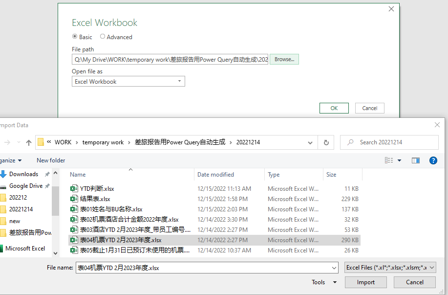

# 1. 文件说明
路径下有以下7个excel文件
1. YTD判断.xlsx
3. 表01姓名与BU名称.xlsx
4. 表02机票酒店合计金额2022年度.xlsx
5. 表03酒店YTD 2023年度_带员工编号.xslx
6. 表04机票YTD 2023年度.xlsx
7. 表05已预订未使用的机票.xlsx
8. 表06结果表.xlsx

### 1.1 使用说明
请更新除了【表06结果表】之外的表，数据更新之后保存文件，再打开表06刷新。
查看刷新进程可在数据-请求与连接中查看：


### 1.2 请注意: excel文件重命名会导致结果表报错
##### 问题描述
如果前7张任何一个excel文件名发生更改，都会导致【结果表.xlsx】 刷新报错。

所有引用了此表的派生表都会报错：


##### 解决办法：
1. 进入Power Query 找到原表 点击 Go To Error


2. 点击Source


3. 重新现在重命名之后的excel文件

4. 找到其他报错的派生表，修改数据源的绝对路径即可。


<br>

# 2. 文件更新的说明

【结果表.xlsx】中显示的计算结果来自YTD判断、表01、表02、表03、表04及表05的源数据。所以所有在计算过程中引用过的数据，列名或者数据格式的更改都有可能导致结果表报错。建议以后更新源数据的时候明确数据格式。如果发生报错，解决方法同上，进入Power Query，从上到下点击操作步骤，直到找到报错的步骤再进行修改。

<br>

### 2.1 YTD判断.xlsx
###### 数据预览
| Year | Month | 已预订未使用机票-截止日期 | 请填充YTD的截止月份 | 判断    |
|------|-------|---------------|-------------|-------|
| 2022 | 1     | 2/28/2022     | 3           | TRUE  |
| 2022 | 2     | 2/28/2022     | 3           | TRUE  |
| 2022 | 3     | 2/28/2022     | 3           | TRUE  |
| 2022 | 4     | 2/28/2022     | 3           | FALSE |
| 2022 | 5     | 2/28/2022     | 3           | FALSE |
| 2022 | 6     | 2/28/2022     | 3           | FALSE |
| 2022 | 7     | 2/28/2022     | 3           | FALSE |
| 2022 | 8     | 2/28/2022     | 3           | FALSE |
| 2022 | 9     | 2/28/2022     | 3           | FALSE |
| 2022 | 10    | 2/28/2022     | 3           | FALSE |
| 2022 | 11    | 2/28/2022     | 3           | FALSE |
| 2022 | 12    | 2/28/2022     | 3           | FALSE |


###### 表格作用
1. 第一列【Year】是当年年份，如数据预览中所示，该数据预览表示在【表06结果表】中展示的是2022年YTD3月的数据
2. 第二轮【Month】用于表合并 
3. 第三列【已预定未使用机票-截止日期】是当前年YTD月上月的最后一天，如数据预览中所示，2022年3月的上一个月的最后一天，公式：
	```python
 	=EOMONTH(DATE(YEAR(TODAY()),[@请填充YTD的截止月份]-1,1),0)
 	```
4. 第四列【请填充YTD的截止月份】：
   1. 如果你想看YTD 5月的数据，请将第四列整列数字改成5。
      2. 年份不需要手工输入，年份取当前年份。
      3. 即如果现在是2022年，结果表的结果就是2022年YTD 5月的数据。如果现在是2023年，结果表的结果就是2023年YTD5月的数据
5. 第五列公式【判断】
   ```python
   =IF(B2<=D2,TRUE,FALSE)
   ```
###### 更新说明
1. 只有第四列【请填充YTD的截止月份】需要手工更新
2. 想看YTD 1月 -> 整列输入1、 想看YTD 2月 -> 整列输入2
3. 请注意：
   4. 第四列去重之后只能有一个值
   5. 第二列Month请确保1-12，每个月份有且只出现一次


<br>

### 2.2 表01姓名与BU名称.xlsx
###### 数据预览
| Name           | 姓名  | email                    | BU名称                              | SM（排序）      | 工号      |
|----------------|-----|--------------------------|-----------------------------------|-------------|---------|
| Kissinger Chen | 陈敬锋 | kissinger.j.chen@rrd.com | PKG Sachi Operation               | a.Gary Wang | 3525552 |
| Leo Wan        | 万峰  | leo.f.wan@rrd.com        | PKG Emerging Operation&Commercial | b.Eric Shu  | 3627077 |
| Mary Huang     | 黄丽  | mary.l.huang@rrd.com     | Supply Chain                      | g.Xu Bo     | 3524924 |
| Aaron Zhou     | 周伟  | aaron.w.zhou@rrd.com     | PKG Emerging Operation&Commercial | b.Eric Shu  | 3555045 |
| Ivy Chen       | 陈冰如 | ivy.b.chen@rrd.com       | PUB Operation                     | d.Jason Xue | 3609446 |
| Glen Zhang     | 张宝宁 | glen.b.zhang@rrd.com     | Supply Chain                      | g.Xu Bo     | 3399879 |
| Bruce Liu      | 刘俊  | bruce.j.liu@rrd.com      | PKG Emerging Operation&Commercial | b.Eric Shu  | 3634016 |

###### 表格作用
提供姓名/工号 - BU的对应关系

###### 更新说明
请不要修改列名，其他数据正常修改

<br>

### 2.3 表02机票酒店合计金额2022年度
##### 数据预览
| BU      | Month | 去年YTD |
|---------|-------|-------|
| Finance | 1     | 3920  |
| Finance | 2     | 3920  |
| Finance | 3     | 3920  |
| Finance | 4     | 3920  |
| Finance | 5     | 4193  |
| Finance | 6     | 4193  |
| Finance | 7     | 4500  |
| Finance | 8     | 6912  |
| Finance | 9     | 20826 |
| Finance | 10    | 23478 |
| Finance | 11    | 29069 |
| Finance | 12    | 0     |
| HR      | 1     | 24259 |
| HR      | 2     | 32041 |
| HR      | 3     | 39504 |

###### sheet说明
引用的是名为【去年YTD】的sheet，其他sheet的变更不影响最终结果

###### 更新说明
如果以后更新，请保持现在的数据格式。


### 2.3 表03酒店YTD 2023年度_带员工编号.xlsx
###### 数据预览
| RBE_NO          | BIZ_DTE    | RMB_AMT    | HOTEL                          | FROM       | TO         | DAYS | 姓名   | ENGLISHNAME       | 工号    | BUNAME_CN                    | BIZ_LINE              | BUHM                    | SUBMIT_DTE | STATUS   |
|-----------------|------------|------------|--------------------------------|------------|------------|------|--------|-------------------|---------|------------------------------|-----------------------|-------------------------|------------|----------|
| RBE202101020011 | 12/24/2020 |  1000.0000 | 潍坊天成商务宾馆               | 12/24/2020 | 12/29/2020 | 5    | 徐波   | Brain Xu - 277197 | 3360716 | 当纳利(昆山)包装科技有限公司	 | Sachi PKG             | Sachi PKG Operation     | 2022-01-02 | APPROVED |
| RBE202012310030 | 12/25/2020 |   378.0000 | 麗枫酒店                       | 12/24/2020 | 12/25/2020 | 1    | 曹剑勇 | jacky.j.cao       | 3553588 | 当纳利(成都)印刷有限公司     | Emerging PKG Domestic | Emerging PKG Commercial | 2022-01-02 | APPROVED |
| RBE202101030016 | 11/19/2020 |   590.0000 | 万达文华酒店                   | 11/18/2020 | 11/19/2020 | 1    | 袁佳华 | dennis.j.yuan     | 3111936 | 当纳利(上海)贸易有限公司     | General               | Infrastructure          | 2022-01-03 | APPROVED |
| RBE202101040007 | 1/1/2021   | 13410.0000 | 深圳市银濠花园酒店管理有限公司 | 11/17/2020 | 1/1/2021   | 45   | 程宏   | Hong chen         | 3531824 | 东莞当纳利印刷有限公司- 寮步 | Sachi PKG             | Sachi PKG Operation     | 2022-01-04 | APPROVED |

###### 计算中使用到的列
RMB_AMT, 工号, SUBMIT_DTE

###### 更细说明
当有新数据需要更新的时候，不需要删除表中原有的数据，直接拼接即可

###### 计算逻辑
1. 根据工号找到BU
2. 筛选当前年份的数据（SUBMIT_DTE）
3. group by [year,month,BU], sum(RMB_AMT)
4. merge YTD判断.xlsx

### 2.4 表04机票YTD 2023年度.xlsx
###### 数据预览
| 订单号         | 预订日期       | 出票张数 | 退票张数 | 实收实付    | 退票费  | 折扣率  | 乘机人员工编号 | 乘机人 | 改签标签 | 提前预订天数 |
|-------------|------------|------|------|---------|------|------|---------|-----|------|--------|
| 14275173924 | 7/23/2022  | 1    | 0    | 490.00  | 0.00 | 0.49 | 3102821 | 黄惠昀 | 否    | 3      |
| 14275405251 | 4/10/2022  | 1    | 0    | 1330.00 | 0.00 | 0.74 | 3117324 | 张隆恩 | 否    | 3      |
| 14277595740 | 2/27/2022  | 1    | 0    | 950.00  | 0.00 | 0.53 | 3117486 | 严海  | 否    | 11     |
| 14277578204 | 1/29/2022  | 1    | 0    | 940.00  | 0.00 | 0.37 | 3117486 | 严海  | 否    | 2      |
| 14277587633 | 4/14/2022  | 1    | 0    | 580.00  | 0.00 | 0.23 | 3117486 | 严海  | 否    | 5      |
| 14281818649 | 10/22/2022 | 1    | 0    | 870.00  | 0.00 | 0.42 | 3000043 | 王晓娟 | 否    | 5      |

##### 计算中使用到的列
订单号、预定日期、出票张数、退票张数、实收实付、退票费、乘机人员工编号、乘机人、改签标签、提前预定天数

#####
当有新数据需要更新的时候，不需要删除表中原有的数据，直接拼接即可


### 2.5 表05已预订未使用的机票.xlsx
###### 数据预览 
| 订单号         | 持卡人 | 乘客姓名      | 出票时间                | 持卡人员工编号 | 实收实付    |
|-------------|-----|-----------|---------------------|---------|---------|
| 21646200506 | 朱枻豪 | CHU/SAIHO | 2022-11-15 12:50:05 | 3105442 | 1240.00 |
| 21737709722 | 姚红艳 | 姚红艳       | 2022-12-05 11:04:11 | 3367870 | 930.00  |
| 21737674704 | 汤轶凡 | 汤轶凡       | 2022-12-05 11:22:41 | 3113243 | 1490.00 |
| 21739386305 | 黄华勇 | 黄华勇       | 2022-12-05 15:34:14 | 3540329 | 1190.00 |

###### 计算中使用到的列
订单号、持卡人、乘客姓名、出票时间、持卡人员工编号、实收实付

###### 更细说明
请不要修改列名，其他数据正常修改

###### 计算逻辑
1. 基于表05中的持卡人员工编号与表01中的员工编号，合并表05和表01，获取BU信息
2. extract Month from 出票时间
3. 基于Month，将表05与YTD判断.xlsx合并，获取已预定未使用机票-截止日期 
4. 将表05中的出票时间与YTD判断.xlsx中的已预定未使用机票-截止日期对比，只筛选出票时间小于已预定未使用机票-截止日期的数据， 
5. groupby BU 计算count(订单号)和sum(实收实付)
6. 将结果保存在结果表中


### 2.6 表06-结果表
###### sheet说明
只需要关注前三张sheet:
1. 【结果表】:展示所有结果
2. 【04机票明细表_Others】:查看哪些员工的BU是Others及其原因
3. 【03酒店明细_Others】:查看哪些员工的BU是Others及其原因

###### 数据预览
| BU名称                              | 本年度消费金额YTD | 去年消费金额YTD | 机票张数YTD | 平均提前预定天数    | 平均折扣率       | 改签张数YTD | 退票张数YTD | 退票费累计YTD | 至截止日期已订未用机票张数 | 至截止日期已订未用机票费用 |
|-----------------------------------|------------|-----------|---------|-------------|-------------|---------|---------|----------|---------------|---------------|
| PKG Sachi Operation               | 210224.37  | 85055.23  | 21      | 2.391304348 | 0.400869565 | 3       | 2       | 350      |               |               |
| Finance                           | 8473       | 3920      | 4       | 3.25        | 0.475       | 0       | 0       | 0        |               |               |
| Supply Chain                      | 53856      | 69480     | 13      | 5.230769231 | 0.52        | 1       | 0       | 0        |               |               |
| HR                                | 42524.65   | 24259     | 19      | 5.12        | 0.5392      | 5       | 5       | 1014     |               |               |
| Marketing Service                 | 37684.26   | 55326.77  | 17      | 1.222222222 | 0.407777778 | 2       | 1       | 0        |               |               |
| IT                                | 42877.48   | 29383     | 15      | 4.6         | 0.48        | 0       | 0       | 0        |               |               |
| Others                            | 8900       |           | 8       | 4.375       | 0.48875     | 2       | 0       | 0        |               |               |
| PKG Sachi Commercial              | 17183      | 15922     | 17      | 5.166666667 | 0.39        | 0       | 7       | 1797     | 1             | 910           |
| Legal                             |            |           |         |             |             |         |         |          |               |               |
| PKG Emerging Operation&Commercial | 95228.75   | 45174.5   | 34      | 4.5         | 0.461111111 | 3       | 2       | 0        | 2             | 2590          |
| PUB Operation                     |            | 6514      |         |             |             |         |         |          |               |               |
| PUB Commercial                    | 22049      | 7716.68   | 2       | 1           | 0.8525      | 3       | 1       | 154      |               |               |
| John Pecaric                      | 6648       |           | 7       | 4.25        | 0.47875     | 2       | 1       | 426      |


###### 数据说明
假设现在是2023年，且已设定YTD判断.xlsx里的月份为5月：
1. 第二列【本年度消费金额】：2023年YTD 5月的数据，机票金额与酒店金额的总和
2. 第三列【去年消费金额YTD】：2022年YTD 5月的数据，2022年1月到5月机票金额与酒店金额的总和。
3. 第四列【机票张数YTD】：2023年YTD 5月的数据，2023年1月到5月机票张数的总和。
4. 第五列【平均提前预定天数】：2023年 YTD5月的数据，2023年1月到5月平均预定天数的平均数。
5. 第六列【平均折扣率】：2023年 YTD5月的数据，2023年1月到5月折扣率的平均数（已去除折扣率为负数的数据）
6. 第七列【改签张数YTD】:2023年 YTD5月的数据，2023年1月到5月改签张数的总和
7. 第八列【退票张数YTD】：2023年 YTD5月的数据，2023年1月到5月退票张数的总和
8. 第九列【退票费累计YTD】:2023年 YTD5月的数据，2023年1月到5月退票费的总和
9. 第十列【至截止日期已订未用机票张数】：表05中所有【出票日期】小于YTD判断【已预定未使用机票-截止日期的数据】的行数和
10. 第十一列【至截止日期已订未用机票费用】：表05中所有【出票日期】小于YTD判断【已预定未使用机票-截止日期的数据】的实收实付和
	
